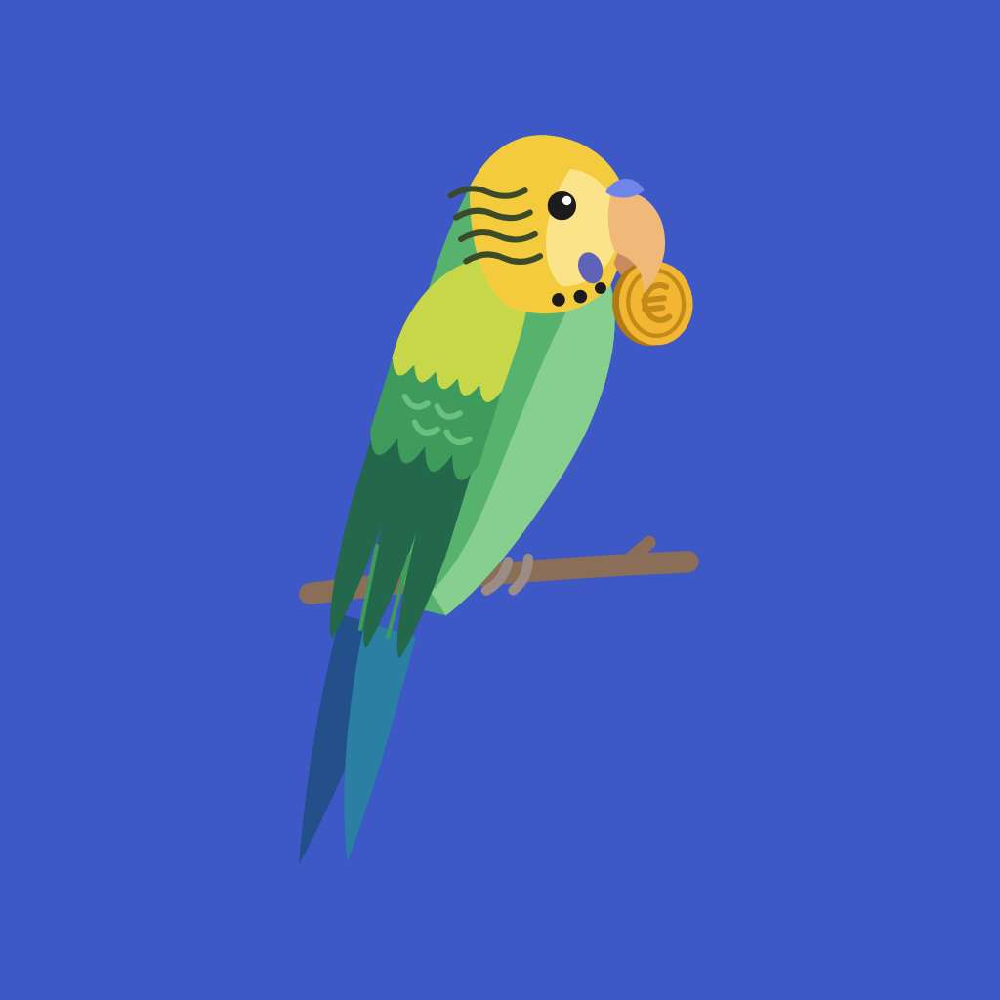
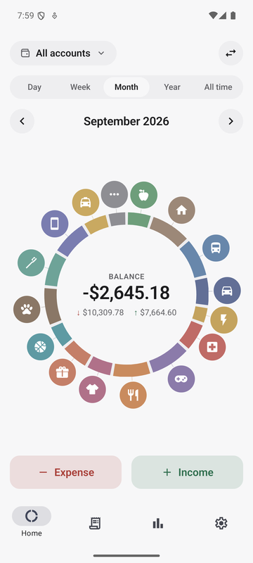
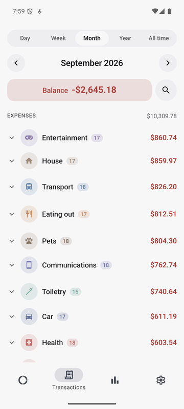
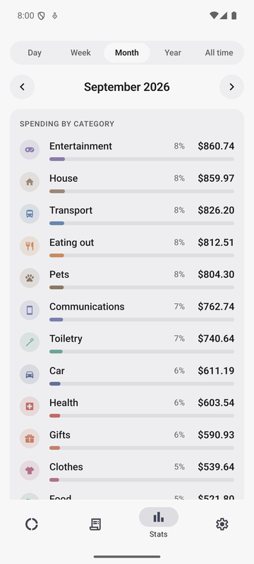
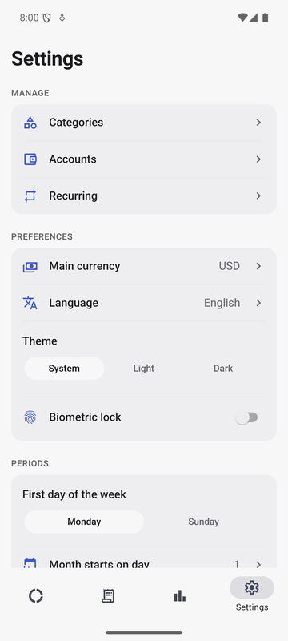

<p align="center">
  
</p>

<h1 align="center">Budgie</h1>

<p align="center">
  A simple, fast personal expense tracker: log a purchase in two taps,<br />
  everything stays on your phone, no account needed.
</p>

<p align="center">
  
  
  
  
</p>

> **Status: beta (0.2.0).** Budgie is being tested on iOS and Android and is not in the app stores
> yet.

## Features

- **Quick entry**: tap a category around the donut, type the amount, done. The keypad also does
  arithmetic (`12+3×2`).
- **Donut home screen** with spending by category and the balance of the period.
- **Periods**: day, week, month, year, all time or a custom range; configurable first day of the
  week and first day of the month (for people paid on the 27th).
- **Multiple accounts**, including different currencies, with transfers.
- **Custom categories** (icon, color, order) that can be archived.
- **Recurring transactions**: rent, subscriptions and salary are logged automatically.
- **Stats** with trend, comparison with the previous period, ranking by category and monthly
  **budgets** with warnings; sections can be reordered.
- **Your data stays yours**: everything is stored on the device. JSON backup and restore, CSV or
  JSON export by date range, biometric lock.
- Light and dark theme, English and Italian, accessibility (screen readers, large text, AA
  contrast).

## Tech stack

[Expo](https://expo.dev) SDK 57 (React Native) with TypeScript and Expo Router · local SQLite with
[Drizzle ORM](https://orm.drizzle.team) · Zustand · Reanimated and Gesture Handler · charts on
`react-native-svg` · i18next · Jest and React Native Testing Library.

More: [architecture](docs/ARCHITECTURE.md), [data model](docs/DATA_MODEL.md),
[UI spec](docs/UI_SPEC.md), [roadmap](docs/PLAN.md).

## Running it locally

You need [Node.js 22](https://nodejs.org) and the **Expo Go** app on your phone (or an Android
emulator / iOS simulator).

```bash
git clone https://github.com/mancusofra/budgie.git
cd budgie
npm install
npx expo start        # then scan the QR code with Expo Go
```

The same checks run in CI:

```bash
npm run lint
npm run typecheck
npm test              # or npm run test:coverage
npx expo-doctor
```

## Project structure

```
src/
├── app/          screens and navigation (Expo Router)
├── components/   UI components, charts, transaction rows
├── features/     logic by area: transactions, accounts, categories, stats, recurring…
├── db/           Drizzle schema, migrations, repositories, backup
├── lib/          pure functions: money, periods, recurrence, CSV, colors
├── i18n/         translations (en, it)
├── store/        UI state (Zustand)
└── theme/        colors and sizes
__tests__/        tests (Jest)
docs/             documentation and screenshots
```

## Contributing

Bug reports and ideas are welcome: please read [CONTRIBUTING.md](CONTRIBUTING.md). Changes are
accepted only through pull requests, which are reviewed by the maintainer before being merged.
For security issues see [SECURITY.md](SECURITY.md).

## License

Copyright (C) 2026 Francesco Mancuso

Budgie is free software: you can redistribute it and/or modify it under the terms of the
[GNU General Public License version 3](LICENSE) (GPL-3.0-only) as published by the Free Software
Foundation.

In short: you may use, study, modify and share the code; if you distribute a modified version you
must make its source code available under the same license. Budgie comes with **no warranty**; see
[`LICENSE`](LICENSE) for the full terms.

**The name and artwork are not covered by the GPL.** The name "Budgie" and the budgie mascot
(icons, launch screen, files in `assets/`) are licensed under
[CC BY-NC-ND 4.0](https://creativecommons.org/licenses/by-nc-nd/4.0/): anyone distributing a
modified version must use their own name and icon. Details in
[`assets/LICENSE.md`](assets/LICENSE.md).
